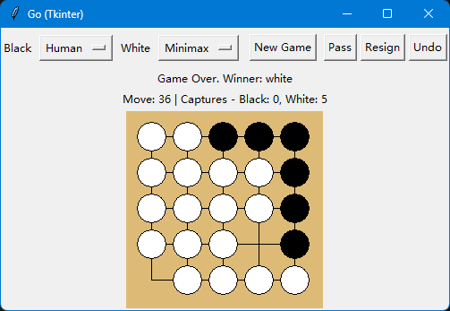
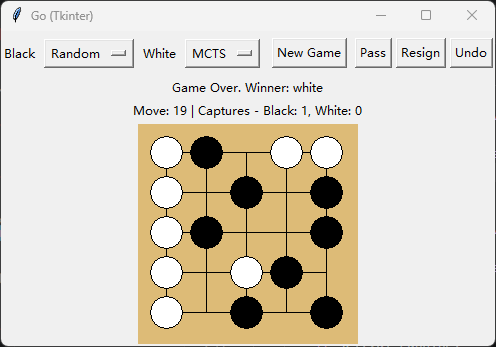
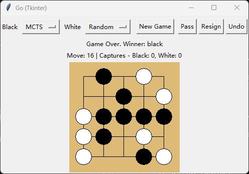
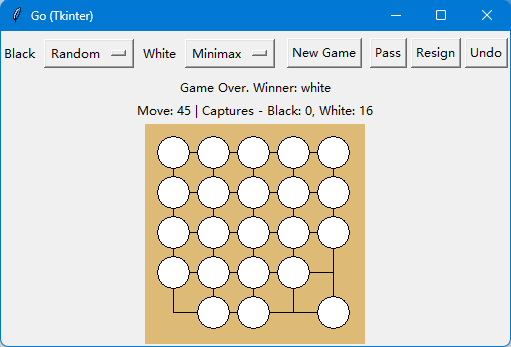
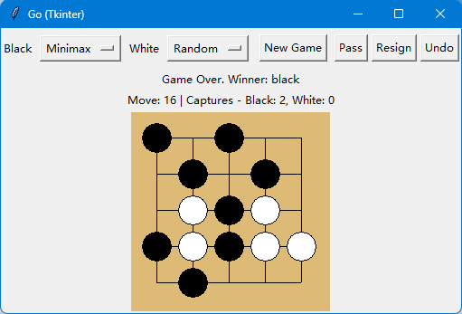
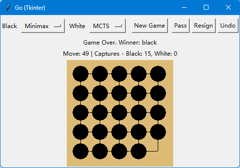
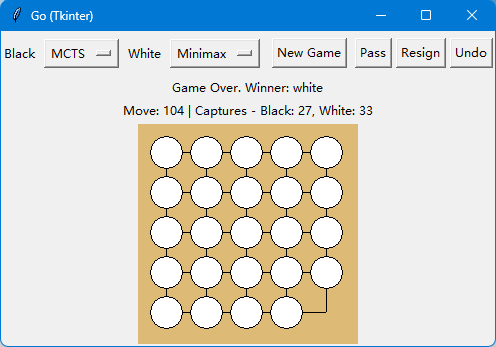

<center><h1>项目1 实验报告</h1></center>

# 一、源代码

## 项目结构

```
hw1/
├── docs/                  # 【文档】作业说明
│   └── homework.pdf       # 作业要求 PDF
│
├── dlgo/                  # 【已提供】围棋规则基础设施
│   ├── __init__.py        # 模块导出
│   ├── gotypes.py         # Player, Point 等基础类型
│   ├── goboard.py         # Board, GameState, Move 核心逻辑
│   ├── scoring.py         # 计分系统
│   └── zobrist.py         # Zobrist 哈希表
│
├── agents/                # 【学生实现】智能体算法
│   ├── __init__.py
│   ├── random_agent.py    # 第一小问：随机 AI
│   ├── mcts_agent.py      # 第二小问：MCTS AI
│   └── minimax_agent.py   # 第三小问：Minimax AI（选做）
│
├── report/                # 报告pdf及其md源文件
│   └── report.md		   # 报告源文件
│
├── example/                       # 对弈示例
│   ├── readme.md		 		   # 相关说明 命名带1的是未进行优化的MCTS算法
│   ├── human_vs_mcts1.mp4		   # 人对蒙特卡洛搜索
│   ├── random_vs_mcts1.mp4		   # 随机对蒙特卡洛搜索
│   ├── mcts_vs_minimax1.mp4	   # 蒙特卡洛搜索对Minimax搜索
│   ├── mcts_vs_mcts1.mp4		   # 蒙特卡洛搜索对蒙特卡洛搜索
│   ├── human_vs_random.mp4		   # 人对随机
│   ├── human_vs_mcts.mp4		   # 人对蒙特卡洛搜索
│   ├── human_vs_minimax.mp4	   # 人对Minimax搜索
│   ├── random_vs_random.mp4	   # 随机对随机
│   ├── random_vs_mcts.mp4		   # 随机对蒙特卡洛搜索
│   ├── random_vs_minimax.mp4	   # 随机对Minimax搜索
│   ├── mcts_vs_minimax.mp4		   # 蒙特卡洛搜索对Minimax搜索
│   ├── mcts_vs_mcts.mp4		   # 蒙特卡洛搜索对蒙特卡洛搜索
│   └── minimax_vs_minimax.mp4     # Minimax搜索对Minimax搜索
│
├── report.pdf		   	   # 报告
├── gui_tk.py			   # 图形化界面程序
├── play.py                # 命令行对弈脚本
└── README.md              
```

---

项目地址https://github.com/wuhulfy/thu-ai-course-hw1-GO

提交的压缩包中，AI模型处于agent文件夹中，图形化界面运行gui_tk.py即可。



如图所示，可在Black/White后更换执黑棋/白棋的搜索模型/人，使用New Game开启下一局，Pass选项跳过一步棋，Resign选项认输，Undo选项悔棋。棋盘上方显示黑/白方下，并显示相应的执棋者。在棋局结束后，会显示游戏结束与获胜方，Move后显示下子回合数，Captures后显示每方提子数量。在鼠标点击规则不允许的落子处时，会提示如下所示的非法落子提示。


## 设计思路

### 1.随机ai

1. **`RandomAgent.select_move()`**

   通过dlgo中的`game_state.legal_moves()`函数获取合法棋步，再使用`random.choice()`函数随机返回一个合法棋步即可；若没有合法棋步，则停一手。
   
   ```python
   		legal_moves = game_state.legal_moves()
           if not legal_moves:
               # 如果没有合法棋步，停一手
               return Move.pass_turn()
           return random.choice(legal_moves)
   ```
   
   

### 2.蒙特卡洛搜索ai

1. **`MCTSNode.best_child()`**
   在已展开子节点中计算 UCT 分数：利用项（平均价值）+ 探索项（访问次数惩罚），选分数最高子节点，平衡“走已知好棋”和“探索新分支”。
   
2. **`MCTSNode.expand()`**
   从 `unvisited_moves` 中取一个尚未扩展的合法动作，生成新局面并创建子节点，挂到当前节点下，便于后续模拟。
   
3. **`MCTSNode.backup()`**
   将模拟结果沿当前节点到根节点逐层回传，更新 `visit_count` 与 `value_sum`；父节点按对手视角进行价值翻转。
   
4. **`MCTSAgent.select_move()`**
   实现“选择→扩展→模拟→回传”循环执行 `num_rounds` 次，最后从根节点子节点中选访问次数最多的动作作为最佳落子返回。
   
5. **`MCTSAgent._simulate()`**
   从当前局面快速 rollout：随机走子到终局或深度上限（设为30）；实现了优化策略（如过滤 `resign`、限制模拟深度），实现了启发式走子，优先提子，其次打吃/救己方打吃，返回时80%选择最优走法，20%概率选择随机返回前3的走子策略，保留一定的探索倾向进行模拟，并将结果转换为数值回报用于回传。
   
   主要逻辑：
   
   ```python
   if s.color != current_state.next_player:
   	if s.num_liberties == 1:
       	score += 1000   # 提子优先
       elif s.num_liberties == 2:
           score += 80     # 打吃倾向
   else:
       if s.num_liberties == 1:
           score += 300    # 救己方打吃
       else:
           score += 10
   scored.append((score, m))
   ```

### 3.minimax搜索ai

1. **`MinimaxAgent.minimax()`**
   在给定深度内递归搜索博弈树：我方层取最大值、对手层取最小值；若达到终局或 `depth==0`，直接调用评估函数返回局面分数。
   
2. **`MinimaxAgent.alphabeta()`**
   在 minimax 基础上加入 `alpha/beta` 上下界，搜索过程中动态更新边界；当 `beta <= alpha` 时立即剪枝，减少无效分支展开。
   
   基础逻辑如下，最终实现因接入置换表有所不同。
   
   ```python
               max_eval = -float('inf')
               for move in self._get_ordered_moves(game_state):
                   next_state = game_state.apply_move(move)
                   eval_val = self.alphabeta(next_state, depth - 1, alpha, beta, False)
                   max_eval = max(max_eval, eval_val)
                   alpha = max(alpha, eval_val)
                   if beta <= alpha:
                       break	# Beta 剪枝
               return max_eval
           
               min_eval = float('inf')
               for move in self._get_ordered_moves(game_state):
                   next_state = game_state.apply_move(move)
                   eval_val = self.alphabeta(next_state, depth - 1, alpha, beta, True)
                   min_eval = min(min_eval, eval_val)
                   beta = min(beta, eval_val)
                   if beta <= alpha:
                       break	# Alpha 剪枝
               return min_eval
   ```
   
3. **`MinimaxAgent._default_evaluator()`**
   终局时返回大绝对值（胜/负）保证结果优先；非终局时基于“子数差 + 气数差×3”进行静态评估。气数统计时按棋串去重后累加，避免重复计算同一串棋的气。
   
4. **`MinimaxAgent._get_ordered_moves()`**
   对合法棋步先区分落子与非落子，再按启发式分数排序，优先搜索更可能优的分支，以提高 Alpha-Beta 剪枝命中率。
   
5. **`MinimaxAgent._move_score()`**
   落子评分主要依据邻接棋串的局部形势：优先提子、其次打吃，同时给己方1气棋串补气加分，使排序更贴近实战局部价值。
   
   ```python
   if neighbor_string.color != game_state.next_player:
       if neighbor_string.num_liberties == 1:
           score += 1000
       else:
           score += 10
   else:
       if neighbor_string.num_liberties == 1:
           score += 500
       else:
           score += 5
   ```
   
6. **`GameResultCache.put()`**
   
   在 `alphabeta() `中接入置换表：先用` (next_player, board.zobrist_hash()) `查缓存；当缓存深度足够时按 `exact/lower/upper `直接返回或收紧 alpha/beta；搜索完成后再用` put()` 写回` (depth, value, flag)`。减少了重复局面搜索，提高了 Alpha-Beta剪枝的搜索效率与稳定性。

### 4.图形化界面

规则与搜索都复用 dlgo 和 agents，不在 GUI 里重复实现棋规。

1. **界面结构分层**

   顶部控制区（黑白执棋类型选择、New Game、Pass、Resign、Undo），中间状态文本（当前回合/提子数/终局信息），底部 Canvas 棋盘 。

2. **状态统一管理**

   以` self.game_state `作为唯一局面真值，落子统一走` _apply_move()`，同步更新：`move_count`，`black_captures/white_captures`，`history`

3. **交互到规则引擎的映射**

   鼠标点击先做像素到棋盘坐标映射，再构造 `Move.play(Point)`；通过` is_valid_move() `校验，合法才`apply_move()`，非法弹窗提示。

4. **人机/机机统一流程**

   黑白双方都可选 `Human/Random/MCTS/Minimax`。每步后调用` _maybe_run_ai()`：若当前轮到 AI，就自动触发下一手。

5. **避免界面卡顿**

   AI 计算放到后台线程，主线程只负责绘制；用` state_serial `防止旧线程结果覆盖新局面。

6. **悔棋策略**

   在人机模式下，Undo 优先回到“人下子前”（一次撤销人+AI两步），交互上更符合直觉。

# 二、AI对战结果分析

| 棋局数 | 黑方    | 白方    | 平均总步数（四舍五入） | 胜场(黑方/白方) |
| ------ | ------- | ------- | ---------------------- | --------------- |
| 20     | Random  | MCTS    | 22                     | 1/19            |
| 20     | MCTS    | Random  | 27                     | 16/4            |
| 20     | Minimax | Random  | 25                     | 19/1            |
| 20     | Minimax | MCTS    | 43                     | 20/0            |
| 20     | MCTS    | Minimax | 41                     | 0/20            |
| 20     | Random  | Minimax | 23                     | 0/20            |

### 1.Random_vs_MCTS





多次实验发现，MCTS搜索的效果优于随机算法。

### 2.Random_vs_Minimax





多次实验发现，minimax搜索的效果优于随机算法。

### 3.MCTS_vs_Minimax





实验发现，在小棋盘的情况下，minimax搜索的效果优于MCTS搜索。

### 4.优化MCTS算法与否

通过示例视频可以发现，在MCTS算法未加入启发式走子策略时，提升局面选择的鲁棒性显著降低，较容易出现早巡跳过的情况，导致棋局快速结束。

在增加MCTS算法的模拟深度（30$\rightarrow $50）后，思考时间显著增长，但做出的最优选择的鲁棒性并未显著提升，证明在小棋盘的情况下限制搜索深度可能能提升MCTS算法的效率。

在限制MCTS算法的模拟深度（30$\rightarrow $5）后思考时间显著缩短，但做出的最优选择的鲁棒性显著降低，证明在小棋盘的情况下搜索深度需要进行一定的衡量后设置才能达到最佳效果。

### 5.总结

在 5×5 棋盘下，`Random` 作为基线策略表现最弱，走子不稳定且经常错失提子与防守机会；`MCTS` 与 `Minimax` 均明显优于随机策略，说明搜索方法相较随机落子有显著优势。`MCTS` 的优势在于通过多轮模拟提升局面选择的鲁棒性，在中后盘更容易走出稳定手；`Minimax+Alpha-Beta剪枝` 的优势在于小棋盘上搜索较充分、局部战术响应快，配合“子数差+气数差”的评估函数后，对打吃与救子更敏感。MCTS算法的模拟深度需要经过测试后决定才能呈现最佳效果，启发式搜索可以提升整体效果。整体上，实验结果与算法预期一致：**Random <（MCTS, Minimax）**。同时可以发现，在较小棋盘下，上述算法可能并不能显著优于人类下棋。

# 三、与 AlphaGo/AlphaZero 的对比思考

从上述实验可以发现，MCTS 主要靠深度模拟，Minimax 主要靠评估函数；而 AlphaGo/AlphaZero 是“搜索 + 学习”，用神经网络给出策略先验和价值评估，再由 MCTS 做引导搜索。两者最大差异不在“有没有搜索”，而在“搜索是否被强模型引导”。本项目验证了搜索框架本身有效，但也说明了“仅靠搜索”与“搜索+学习”之间存在较大差距。


## AI 辅助声明

本作业在 **Gemini - 3.2+Github Copilot ** 的辅助下完成了图形化界面的设计，同时在其帮助下理解了dlgo中围棋的规则实现和具体函数作用及其接口，进而实现了后续的算法设计。

部分算法的debug及报告的语言润色亦使用了上述工具的帮助，主要通过复制相关报错信息提问及分析具体代码实现。

算法设计、功能取舍、代码调试与最终结果验证由本人独立完成。本人已逐段检查并理解所有提交代码，对作业内容与结果负责。

最大的感受在于现在AI的代码能力已经到了非常强大的地步，能够在大多数场景中得到正常的应用，同时能够借此辅助人们的代码学习。
